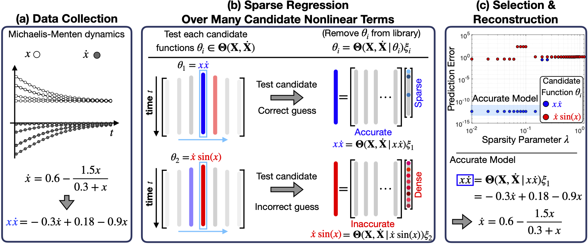

# SINDy-PI: A Robust Algorithm for Parallel Implicit Sparse Identification of Nonlinear Dynamics

SINDy-PI is a robust algorithm for parallel implicit sparse identification of nonlinear dynamics algorithm. The SINDy-PI algorithm implicit dynamical systems in a robust and parallel optimization.  The details of the approach are in our arXiv paper.  []

## Examples
### Belousov–Zhabotinsky (BZ) Reaction

The Belousov–Zhabotinsky (BZ) reaction is a classical example of non-equilibrium thermodynamics, which can be described by a rational PDE. The strong coupling dynamics and implicit behavior make the data-driven discovery of the BZ reaction challenging when using implicit-SINDy and PDE-FIND. However, SINDy-PI correctly identifies the dynamics.

### Modified Korteweg–de Vries (KdV) Equation

The Korteweg–de Vries (KdV) equation is a mathematical model of shallow water waves. We modify the KdV equation to include a rational gain term and use SINDy-PI to identify the model.   

### Mounted Double Pendulum

The double pendulum is a classic example of chaotic dynamics. Correctly identifying the equations of motion of the double pendulum is a challenging task due to the rational terms in the dynamics. Moreover, the complexity of the double pendulum ODEs make it challenging to use implicit-SINDy. However, SINDy-PI is able to correctly identify the dynamics.

### Single Pendulum on a Cart

For many robotic systems, there is actuation applied to the system. We consider a classic example of a single pendulum on a cart and use SINDy-PI to identify the underlying ODE of the system.

### Yeast Glycolysis

To compare the data usage of implicit-SINDy and SINDy-PI, we use yeast glycolysis as an example.

## Dependencies:

* CVX optimization packages for Matlab.  CVX is used for the constrained formulation of the SINDy-PI.
* [Simulation data](https://drive.google.com/file/d/13sGPmjup8IvJL-TdKJvJRUmFUQ84zevA/view?usp=sharing) of the Michaelis Menten kinetics under multiple initial conditions. This data set is used for the comparison of implicit-SINDy and SINDy-PI under different noise levels. Please unzip it in the "Comparison\NoiseSenstivity\Michaelis-Menten kinetics\Datas" folder for use.
